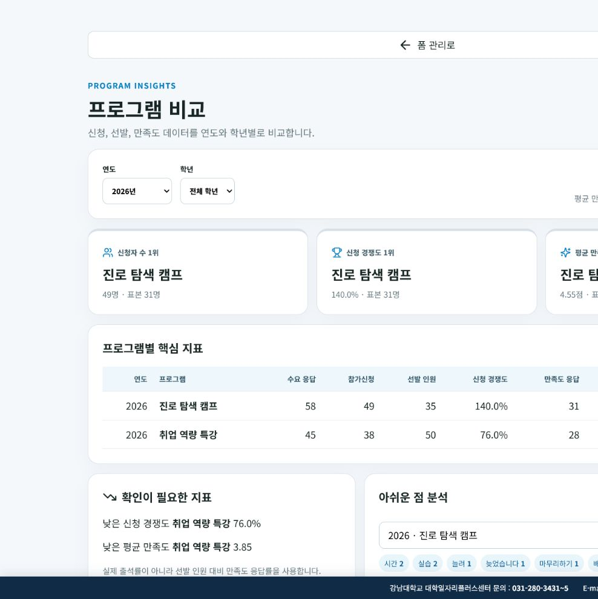

# 대플폼

## 서비스 개요

대플폼은 대학일자리플러스센터의 교육 프로그램 만족도 조사를 제작·배포하고 응답 결과를 통합 관리하는 전용 설문조사 서비스입니다.

### 문제 정의

프로그램 만족도 조사마다 수백 건 이상의 주관식 의견을 검토·요약·분류하는 데 많은 시간이 소요됩니다. 설문별 응답 데이터가 분산되어 있어 프로그램의 장기적인 만족도 추이를 분석하기도 어렵습니다.

### 해결 방법

AI를 활용해 주관식 응답의 핵심 요지를 자동으로 추출하고 결과를 시각화하여 요약합니다. 설문 데이터를 통합 관리하고 학년·연도별 비교 통계를 대시보드로 제공합니다.

PDF, 이미지, HWP/HWPX 참고자료와 담당자 메모를 기반으로 폼 초안을 생성할 수 있으며, AI를 사용하지 않고 직접 작성할 수도 있습니다.

### 기대 효과

만족도 결과 보고서 작성에 필요한 실무 처리 시간을 단축합니다. 축적된 정량·정성 데이터를 교차 분석하여 다음 학기 취업 연계 서비스의 개선 방향과 의사결정을 지원합니다.

## 기술 구성

- React
- TypeScript
- Firebase
- Gemini
- Vite

## 주요 기능

- Google 또는 이메일 링크 기반 제작자 인증
- Gemini 기반 폼 초안 생성 및 직접 작성
- 질문·섹션·필수 여부·조건부 분기 설정
- 공개 범위·참여 대상·접수 기간·중복 제출 제한 설정
- 테마 적용, 공개 링크 및 QR 코드 배포
- 응답 임시 저장, 제출값 검증 및 결과 대시보드 제공
- 응답 원본·통계 Excel 내보내기
- Google 스프레드시트 자동 저장 연동
- 수요조사·참가신청·만족도조사 통합 비교
- 폼·프로그램 휴지통, 복구 및 영구 삭제
- 조직 공유 공간 및 공동 편집 권한 관리

## 사용 절차

```text
로그인
→ 폼 생성(AI 또는 직접 작성)
→ 기본정보·질문·섹션 편집
→ 디자인·참여 정책 설정
→ 링크·QR 코드 배포
→ 응답 확인 및 내보내기
→ 프로그램별 결과 비교
```

## 로컬 실행

Node.js 22 사용을 권장합니다.

```bash
npm ci
npm --prefix functions ci
cp .env.example .env.local
npm run dev
```

Windows PowerShell:

```powershell
Copy-Item .env.example .env.local
```

## 환경 변수

`.env.example`을 복사하여 `.env.local`을 생성한 뒤 Firebase 웹 앱 설정값을 입력합니다.

```dotenv
VITE_FIREBASE_API_KEY=your_firebase_web_api_key
VITE_FIREBASE_AUTH_DOMAIN=your-project.firebaseapp.com
VITE_FIREBASE_PROJECT_ID=your-project-id
VITE_FIREBASE_STORAGE_BUCKET=your-project.firebasestorage.app
VITE_FIREBASE_MESSAGING_SENDER_ID=your_sender_id
VITE_FIREBASE_APP_ID=your_app_id
VITE_FIREBASE_MEASUREMENT_ID=your_measurement_id
VITE_FIREBASE_APPCHECK_RECAPTCHA_ENTERPRISE_SITE_KEY=your_recaptcha_enterprise_site_key
VITE_GOOGLE_SHEETS_APPS_SCRIPT_URL=https://script.google.com/macros/s/your-deployment-id/exec
VITE_ENABLE_DEMO_AUTH=false
VITE_ENABLE_ORGANIZATION_FORMS_FUNCTION=false
```

- `VITE_GOOGLE_SHEETS_APPS_SCRIPT_URL`: Google 스프레드시트 자동 저장 사용 시 설정
- `VITE_ENABLE_DEMO_AUTH`: 로컬 데모 인증용 설정. 운영 환경에서는 `false`
- `VITE_ENABLE_ORGANIZATION_FORMS_FUNCTION`: 조직 공유 폼을 Functions에서 조회할 때 `true`

Firebase 상세 설정은 [`FIREBASE_SETUP.md`](./FIREBASE_SETUP.md)를 참고합니다. Cloud Functions 환경 변수는 [`functions/.env.example`](./functions/.env.example)을 기준으로 별도 설정합니다.

## Firebase 설정 및 배포

다음 항목을 사전에 설정해야 합니다.

- Authentication 공급자
- Firestore Database 및 Cloud Storage
- Firebase AI Logic 및 Gemini API
- App Check 및 reCAPTCHA Enterprise
- Cloud Functions 및 Hosting 배포 권한
- Firestore·Storage 보안 규칙과 Firestore 인덱스

```bash
npm run build
npm run build:functions
firebase deploy
```

## 프로그램 통합 비교

폼을 `수요조사`, `참가신청`, `만족도조사`로 분류하고 동일한 프로그램에 연결하면 다음 항목을 비교할 수 있습니다.

- 수요 응답, 참가 신청, 선발 인원 및 신청 경쟁도
- 만족도 응답 수, 응답률 및 평균 평점
- 학년별 신청·만족도 응답 분포
- 연도별 만족도 변화
- 낮은 응답률·평균 만족도 및 개선 의견

프로그램을 휴지통으로 이동해도 연결된 폼과 응답은 유지됩니다. 영구 삭제 시 프로그램 연결은 복구할 수 없습니다.



## Google 스프레드시트 연동

Apps Script를 이용해 응답용 스프레드시트를 생성하고 새 응답을 약 1분 간격으로 저장합니다. 설정 방법은 [`apps-script/README.md`](apps-script/README.md)를 참고합니다.

## 폴더 구조

```text
├── src/                # 웹 애플리케이션
├── functions/          # Cloud Functions 및 테스트
├── apps-script/        # Google Sheets 연동 웹 앱
├── docs/               # 문서 및 이미지
├── scripts/            # 점검·개발 스크립트
├── test/               # Firestore 보안 규칙 테스트
├── firestore.rules     # Firestore 접근 제어
├── storage.rules       # Storage 접근 제어
├── firebase.json       # Firebase 설정
└── .env.example        # 환경 변수 예시
```

## 검증

```bash
npm run build
npm run build:functions
npm run lint
npm test
npm run test:functions
npm run test:firestore-rules
npm run security:scan
```

에뮬레이터 스모크 테스트:

```bash
npm run test:functions:emulator
```

## 주의사항

- `.env.local`과 Firebase 서비스 계정 키를 저장소에 커밋하지 않습니다.
- 운영 환경에서는 `VITE_ENABLE_DEMO_AUTH=false`를 유지합니다.
- 배포 전에 App Check, 인증 공급자 및 보안 규칙을 확인합니다.
- 개인정보가 포함된 첨부자료와 응답의 접근 권한·보존 기간을 관리합니다.
- AI가 생성한 문항과 개인정보 동의 문구는 담당자가 검토합니다.
